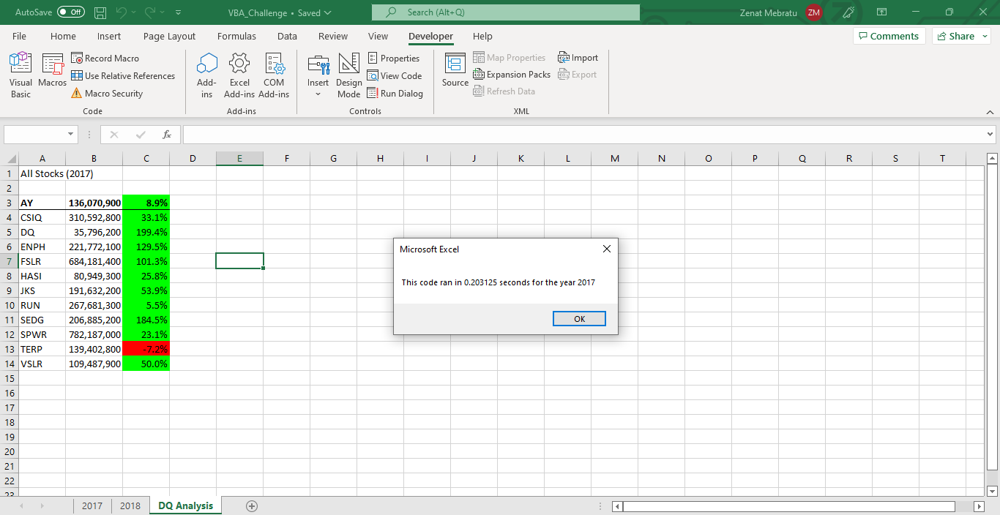
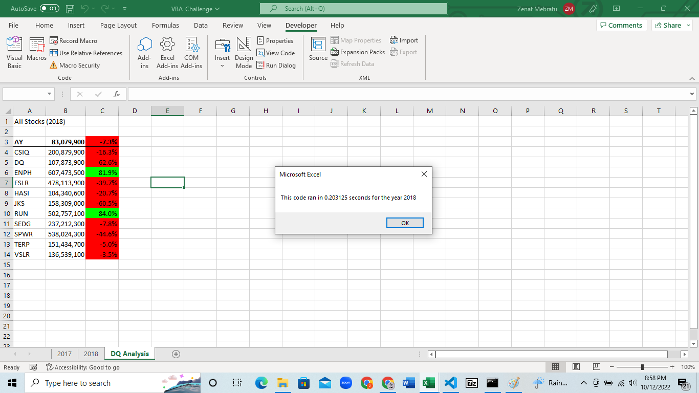

# Stocks-analysis

## Overview of Project
During our project, Steve, who recently completed his Financial Degree, collaborated with us to evaluate a potential investment in DAQO, a New Energy Corporation specializing in silicon wafers for solar panels. While this investment may seem attractive, Steve wanted to provide alternative options to his parents to avoid investing all their money in one company and to diversify their funds into other green energy stocks. To streamline our analysis, we utilized Visual Basic for Applications, an editable programming code that interacts with Excel to perform calculations and analysis. This approach ensured consistency and saved time compared to manual analysis.
 
### Results
After optimizing the VBA code, the script's performance improved significantly compared to the original version. In 2017, the code's runtime was approximately 0.5 seconds, but after the modifications, it dropped to 0.2 seconds. Similarly, in 2018, the script took 0.48 seconds to execute, but after refactoring, its runtime was also reduced to 0.2 seconds. It is worth noting that 2017 had a higher number of positive returns than 2018. However, only ENPH managed to achieve positive returns for both years, while TERP suffered losses in both.

## Summary
In our previous project, we utilized a process called Code Refactoring, which involves restructuring the code while maintaining its original function and external behavior. This process offers several benefits to the coding process, including increased productivity and techniques for faster code execution. Some of the advantages of Code Refactoring include:

* Facilitating the discovery and fixing of bugs.
* Improving software design and increasing its comprehensibility.
* Preventing code duplication and eliminating superfluous or confusing code.
* Creating cleaner code with shorter and more self-contained methods.
* Enhancing testability.

However, Code Refactoring also has its disadvantages, such as:

* The possibility of introducing new bugs and errors.
* Lack of a clear definition of "clean code".
* Requiring higher coordination in team settings.
* Not always resulting in immediate benefits, as the functionality may remain unchanged.

We applied these advantages to our VBA macro, and successfully modified the code to execute faster than before. Specifically, we used an if function to check if the current row was the first or last row with the selected ticker, rather than only checking starting and ending prices. We accomplished this in fewer steps than the previous code. Additionally, we consolidated three separate for loops into a single one, which outputs the ticker, total daily volume, and return.
