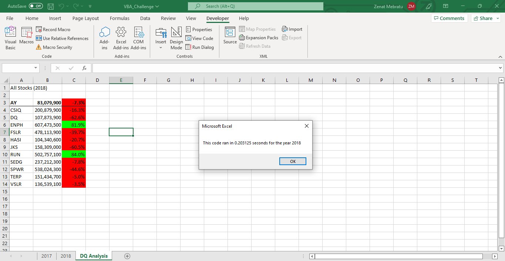

# Stocks-analysis

## Overview of Project
This project was done to analyze several stocks between 2017 and 2018 to determine if the refactored VBA code reduced the amount of time that the script would run.

### Results
After refactoring the VBA code, the script did run faster than the original code. In 2017, the code ran for about 0.5 seconds but after the changes were made, it ran for 0.2 seconds. In 2018 the script took 0.48 seconds but after refactoring, it now runs for 0.2 seconds also. We can also see that 2017 had more positive returns that 2018. However, the only stock that was able to gain positive returns for both years was ENPH.

## Summary
Some of the advantages of refactoring code include less memory being used, a quicker run time and a more specific/defined code. A disadvantage to it is the possibility of including more errors. In addition to this, it might be time-consuming. 
In comparison to the original VBA script, we were able to cut down on the time it takes for the script to load. In addition to this, the refractored code was more understandable and concise. However, in a larger scale it would be difficult to refactor thousands of stocks at once.
